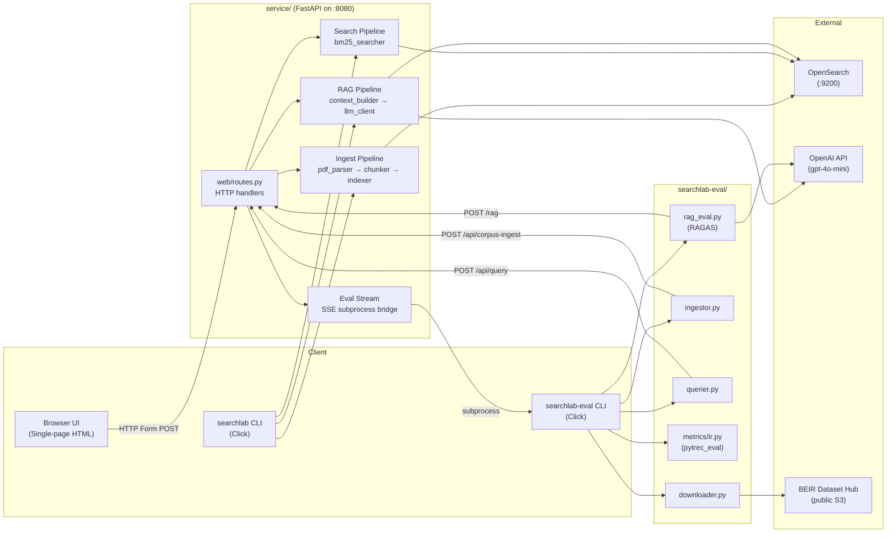
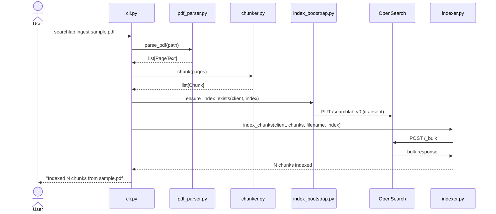
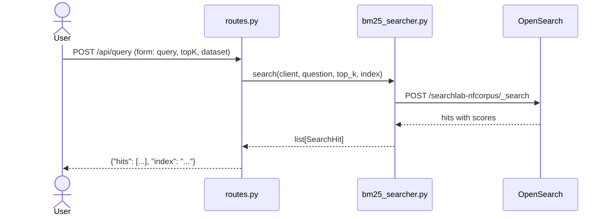
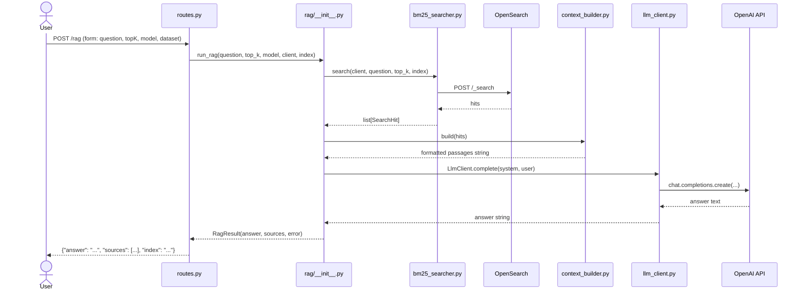
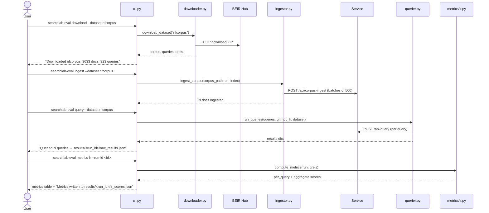

# SearchLab Developer Wiki

> Primary audience: Junior Engineers · New Team Members · QA Engineers · AI Coding Agents
>
> Use this document to answer: *What does this system do? Where do I make this change? What could break? How do I test it?*

---

## Table of Contents

1. [System Overview](#1-system-overview)
2. [Repository Structure](#2-repository-structure)
3. [Component Catalog](#3-component-catalog)
4. [End-to-End Workflows](#4-end-to-end-workflows)
5. [Change Impact Guide](#5-change-impact-guide)
6. [Bug Investigation Playbook](#6-bug-investigation-playbook)
7. [Data Flow Documentation](#7-data-flow-documentation)
8. [Dependency Map](#8-dependency-map)
9. [Configuration Guide](#9-configuration-guide)
10. [Testing Guide](#10-testing-guide)
11. [Troubleshooting Guide](#11-troubleshooting-guide)
12. [Junior Developer Task Catalog](#12-junior-developer-task-catalog)
13. [Where Should I Make This Change?](#13-where-should-i-make-this-change)
14. [Future Improvements](#14-future-improvements)

---

## 1. System Overview

### Purpose

SearchLab is a **hands-on search engineering lab** — a platform for experimenting with information retrieval and Retrieval-Augmented Generation (RAG) pipelines. It solves two interrelated problems:

1. **Search over documents**: Ingest PDFs or BEIR benchmark corpora, then retrieve relevant passages using BM25 (keyword) search.
2. **Answering questions with citations**: Use retrieved passages as context for an LLM to generate grounded answers, with source attribution.

**Main capabilities:**

| Capability | Description |
|---|---|
| PDF ingestion | Parse a PDF, split into token-based chunks, index into OpenSearch |
| BEIR corpus ingestion | Load standard IR benchmark datasets and index at scale |
| BM25 search | Keyword-based retrieval from OpenSearch |
| RAG pipeline | Retrieve → assemble context → generate answer via OpenAI |
| IR evaluation | Score retrieval quality (nDCG, MAP, Recall) against BEIR qrels |
| RAG evaluation | Score answer quality (Faithfulness, Answer Relevancy, Context Recall/Precision) via RAGAS |
| Web UI | Browser-based single-page app for all of the above, including live eval streaming |

### Architecture Diagram



---

## 2. Repository Structure

```
searchlab/
├── service/                    # FastAPI backend + CLI
│   ├── pyproject.toml          # Package metadata and dependencies
│   └── searchlab/              # Python package
│       ├── config.py           # All env var configuration
│       ├── main.py             # FastAPI app factory
│       ├── cli.py              # Click CLI (searchlab command)
│       ├── ingest/             # PDF parsing, chunking, OpenSearch indexing
│       ├── opensearch/         # Client factory + index bootstrap
│       ├── search/             # BM25 retrieval
│       ├── rag/                # LLM context building + OpenAI calls
│       └── web/                # HTTP routes + HTML template
│   └── tests/                  # Unit and integration tests
│
├── searchlab-eval/             # Standalone eval harness
│   ├── pyproject.toml
│   └── searchlab_eval/         # Python package
│       ├── cli.py              # Click CLI (searchlab-eval command)
│       ├── downloader.py       # BEIR dataset download
│       ├── slicer.py           # Query subsetting
│       ├── ingestor.py         # REST client for corpus ingest
│       ├── querier.py          # REST client for BM25 search
│       ├── rag_eval.py         # RAGAS scoring
│       └── metrics/ir.py       # pytrec_eval wrapper (nDCG, MAP, Recall)
│   └── tests/                  # Unit and integration tests
│   └── data/                   # Downloaded BEIR datasets (git-ignored)
│   └── results/                # Eval run outputs (git-ignored)
│
├── specs/                      # Design and planning documents
├── docker-compose.yml          # OpenSearch container
└── docs/
    └── wiki.md                 # This document
```

### Directory Purpose Table

| Folder | Purpose | What belongs here | What does NOT belong here |
|---|---|---|---|
| `service/searchlab/ingest/` | PDF-to-OpenSearch pipeline | Parsing, chunking, bulk indexing | Search logic, API routes |
| `service/searchlab/opensearch/` | OpenSearch connection + index management | Client factory, index mapping | Business logic, query building |
| `service/searchlab/search/` | Retrieval logic | BM25 query execution, result mapping | LLM calls, ingestion |
| `service/searchlab/rag/` | Answer generation | Context building, LLM client, orchestration | OpenSearch queries, routes |
| `service/searchlab/web/` | HTTP layer | FastAPI routes, HTML template | Business logic |
| `service/searchlab/config.py` | All configuration | Env var readers, defaults | Any logic beyond reading env |
| `searchlab-eval/searchlab_eval/` | Evaluation-only code | Download, ingest-via-REST, query-via-REST, scoring | Service implementation code |
| `searchlab-eval/data/` | BEIR dataset files | Downloaded corpus/queries/qrels | Code, results |
| `searchlab-eval/results/` | Eval run outputs | `raw_results.json`, `ir_scores.json`, `rag_scores.json` | Code, datasets |

---

## 3. Component Catalog

### 3.1 Config (`service/searchlab/config.py`)

**Purpose:** Single source of truth for all runtime configuration. All other modules call functions from this file rather than reading `os.environ` directly.

**Responsibilities:**
- Read environment variables with safe defaults
- Expose typed accessor functions

**Key functions:**

| Function | Env Var | Default |
|---|---|---|
| `opensearch_url()` | `OPENSEARCH_URL` | `http://localhost:9200` |
| `index_name()` | `SEARCHLAB_INDEX` | `searchlab-v0` |
| `openai_api_key()` | `OPENAI_API_KEY` | `None` |
| `llm_model()` | `SEARCHLAB_LLM_MODEL` | `gpt-4o-mini` |
| `llm_judge_model()` | `SEARCHLAB_LLM_JUDGE_MODEL` | `gpt-4o-mini` |

**Used by:** All other modules in `service/searchlab/`.

**Common change areas:** Adding a new env var — add a function here, never read `os.environ` elsewhere.

---

### 3.2 Ingest Pipeline

**Purpose:** Turn a PDF file (or BEIR corpus) into searchable documents in OpenSearch.

**Modules:** `ingest/pdf_parser.py` → `ingest/chunker.py` → `ingest/indexer.py`

**Responsibilities:**
- Extract per-page text from PDFs (pymupdf)
- Split text into fixed-size token windows (tiktoken, 512 tokens, no overlap)
- Bulk-index chunks into OpenSearch with metadata

**Key classes/functions:**

| Symbol | File | Role |
|---|---|---|
| `parse_pdf(path)` | `pdf_parser.py` | Returns `list[PageText]` — per-page text |
| `PageText` | `pdf_parser.py` | `NamedTuple(page_number, text)` |
| `chunk(pages)` | `chunker.py` | Returns `list[Chunk]` — 512-token windows |
| `Chunk` | `chunker.py` | `dataclass(text, page_number, position)` |
| `index_chunks(client, chunks, filename, index)` | `indexer.py` | Bulk-insert PDF chunks |
| `index_corpus_docs(client, docs, index)` | `indexer.py` | Bulk-insert BEIR docs |

**Document schema in OpenSearch:**

```json
{
  "chunk_id":        "filename_0",
  "chunk_text":      "...",
  "source_filename": "filename.pdf",
  "page_number":     3,
  "chunk_position":  0,
  "ingested_at":     "2026-06-18T12:00:00Z"
}
```

**Common change areas:** Chunk size (`CHUNK_SIZE = 512` in `chunker.py`), adding new metadata fields to the index document in `indexer.py`.

---

### 3.3 OpenSearch Integration

**Purpose:** Manage the OpenSearch connection and index lifecycle.

**Modules:** `opensearch/client.py`, `opensearch/index_bootstrap.py`

**Responsibilities:**
- Create the `opensearch-py` client from config
- Idempotently create the index with the correct field mapping

**Key functions:**

| Function | File | Role |
|---|---|---|
| `create_client(url)` | `client.py` | Returns configured `OpenSearch` instance |
| `ensure_index_exists(client, index)` | `index_bootstrap.py` | Creates index only if absent |

**Index mapping fields:** `chunk_text` (text, standard analyzer), `chunk_id` (keyword), `source_filename` (keyword), `page_number` (integer), `chunk_position` (integer), `ingested_at` (date).

**Common change areas:** Modifying the index mapping — update `INDEX_MAPPING` in `index_bootstrap.py` (note: existing indexes must be re-created manually after a mapping change).

---

### 3.4 Search Pipeline (`service/searchlab/search/`)

**Purpose:** Execute keyword search against indexed documents.

**Module:** `search/bm25_searcher.py`

**Responsibilities:**
- Build and execute a BM25 `match` query against `chunk_text`
- Map raw OpenSearch hits to typed `SearchHit` objects

**Key symbols:**

| Symbol | Role |
|---|---|
| `search(client, question, top_k, index)` | Returns `list[SearchHit]` ranked by score |
| `SearchHit` | `dataclass(rank, score, doc_id, source_filename, page_number, snippet)` |

**Query pattern:**
```json
{"query": {"match": {"chunk_text": "<question>"}}, "size": <top_k>}
```

**Common change areas:** Switching from BM25 to multi-field or semantic search — modify the query dict in `bm25_searcher.py:search()`.

---

### 3.5 RAG Pipeline (`service/searchlab/rag/`)

**Purpose:** Orchestrate retrieve → contextualize → generate to answer a question with LLM citations.

**Modules:** `rag/__init__.py`, `rag/context_builder.py`, `rag/llm_client.py`, `rag/models.py`

**Responsibilities:**
- Validate input (question, API key)
- Retrieve hits via BM25
- Format hits as numbered passage context
- Call OpenAI Chat Completions and return the answer

**Key symbols:**

| Symbol | File | Role |
|---|---|---|
| `run_rag(question, top_k, model, client, index)` | `rag/__init__.py` | Main orchestrator — returns `RagResult` |
| `build(hits)` | `context_builder.py` | Formats hits as `[1] filename: snippet\n...` |
| `LlmClient` | `llm_client.py` | Wraps OpenAI API; raises typed errors |
| `LlmTimeoutError` | `llm_client.py` | Raised on 30-second timeout |
| `LlmApiError` | `llm_client.py` | Raised on HTTP error from OpenAI |
| `RagResult` | `models.py` | `dataclass(answer, sources, error)` |

**System prompt:** *"You are a search assistant. Answer the question using only the provided passages. If the passages do not contain enough information, say so."*

**LLM settings:** `temperature=0`, `timeout=30s`.

**Common change areas:** System prompt in `rag/__init__.py`, context format in `context_builder.py`, model default in `config.py`.

---

### 3.6 Web Layer (`service/searchlab/web/`)

**Purpose:** Expose all pipelines over HTTP and serve the browser UI.

**Modules:** `web/routes.py`, `web/html.py`

**Responsibilities:**
- Define all FastAPI routes (form-based and JSON)
- Serve the single-page HTML UI
- Stream eval subprocess output via Server-Sent Events
- Bridge between HTTP world and internal service functions

**Key symbols:**

| Symbol | Role |
|---|---|
| `router` | `APIRouter` included in the app |
| `render(openai_key_set)` | Renders HTML with API key warning flag |
| `HTML_TEMPLATE` | Entire SPA as an embedded string |

**Common change areas:** Adding a new route — add a handler in `routes.py` and connect it to the UI in `html.py`.

---

### 3.7 CLI (`service/searchlab/cli.py`)

**Purpose:** Command-line interface for all service operations (ingest, query, RAG, serve).

**Entry point:** `searchlab` command (configured in `pyproject.toml`).

**Commands:**

| Command | What it does |
|---|---|
| `searchlab ingest <pdf_path>` | PDF → chunks → OpenSearch |
| `searchlab query <question>` | BM25 search, prints ranked table |
| `searchlab rag <question>` | Full RAG pipeline, prints answer |
| `searchlab serve` | Starts FastAPI server |

**Common change areas:** Adding a new CLI flag — add a `@click.option` to the relevant command in `cli.py` and thread the value through to the service function.

---

### 3.8 Eval Harness (`searchlab-eval/searchlab_eval/`)

**Purpose:** Benchmark retrieval and RAG quality against standard BEIR datasets.

**Entry point:** `searchlab-eval` command.

**Subcommands:**

| Command | What it does |
|---|---|
| `download --dataset <name>` | Downloads BEIR dataset, writes corpus/queries/qrels files |
| `ingest --dataset <name>` | POSTs corpus to service's `/api/corpus-ingest` |
| `query --dataset <name>` | Runs all queries via `/api/query`, writes `raw_results.json` |
| `metrics ir --run-id <id>` | Computes nDCG/MAP/Recall, writes `ir_scores.json` |
| `ragas --dataset <name>` | Runs RAG + RAGAS scoring, writes `rag_scores.json` |

**Key modules:**

| Module | Role |
|---|---|
| `downloader.py` | BEIR download via `beir` library |
| `slicer.py` | Deterministic query subsetting |
| `ingestor.py` | REST client for corpus bulk-ingest |
| `querier.py` | REST client for BM25 queries |
| `metrics/ir.py` | pytrec_eval wrapper |
| `rag_eval.py` | RAGAS scoring pipeline |

---

## 4. End-to-End Workflows

### 4.1 Ingest a PDF

**Business goal:** Make a PDF's content searchable.

**Trigger:** `searchlab ingest <path>` or `POST /api/ingest`

**Step-by-step flow:**

1. User provides a PDF path.
2. `parse_pdf(path)` uses pymupdf to extract text from each page → `list[PageText]`.
3. `chunk(pages)` tokenizes all text with tiktoken (`cl100k_base`) and slices into 512-token windows → `list[Chunk]`.
4. `ensure_index_exists(client, index)` creates the OpenSearch index if it doesn't exist.
5. `index_chunks(client, chunks, filename, index)` bulk-inserts all chunks.
6. Returns count of indexed chunks.

**Classes involved:** `parse_pdf`, `PageText`, `chunk`, `Chunk`, `ensure_index_exists`, `index_chunks`

**External services:** OpenSearch



---

### 4.2 BM25 Search

**Business goal:** Find relevant passages for a keyword query.

**Trigger:** `searchlab query <question>` or `POST /api/query`

**Step-by-step flow:**

1. User provides a question text.
2. `search(client, question, top_k, index)` issues `{"query": {"match": {"chunk_text": question}}}` to OpenSearch.
3. Raw hits are mapped to `SearchHit` objects with rank, score, snippet.
4. Results are returned/printed ranked by relevance score (descending).

**Classes involved:** `search`, `SearchHit`

**External services:** OpenSearch



---

### 4.3 RAG (Question Answering)

**Business goal:** Answer a question using retrieved passages and an LLM.

**Trigger:** `searchlab rag <question>` or `POST /rag`

**Step-by-step flow:**

1. User provides a question.
2. `run_rag()` validates question is non-empty and `OPENAI_API_KEY` is set.
3. BM25 search retrieves top-K hits.
4. `build(hits)` formats hits as numbered passages.
5. `LlmClient.complete(system_prompt, user_prompt)` calls OpenAI Chat Completions with `temperature=0`.
6. Answer and source list are returned as `RagResult`.

**Classes involved:** `run_rag`, `search`, `build`, `LlmClient`, `RagResult`

**External services:** OpenSearch, OpenAI API



---

### 4.4 BEIR Corpus Evaluation (IR Metrics)

**Business goal:** Measure retrieval quality on a standard benchmark.

**Trigger:** Run from the Eval tab in the UI or `searchlab-eval` CLI steps.

**Step-by-step flow:**

1. `download`: Downloads BEIR dataset, writes `corpus.jsonl`, `queries.jsonl`, `qrels/test.tsv`.
2. `ingest`: Reads `corpus.jsonl` in 500-doc batches, POSTs to `/api/corpus-ingest`.
3. `query`: Iterates all queries, POSTs to `/api/query`, writes `raw_results.json`.
4. `metrics ir`: Loads `raw_results.json` + `qrels/test.tsv`, computes metrics with pytrec_eval, writes `ir_scores.json`.



---

### 4.5 RAG Evaluation (RAGAS)

**Business goal:** Measure answer quality — faithfulness, relevancy, context coverage.

**Trigger:** `searchlab-eval ragas --dataset <name>` or UI "RAG Eval" button.

**Step-by-step flow:**

1. Load queries and corpus from `data/<dataset>/`.
2. For each query, call `POST /rag` on the service → collect `{answer, sources}`.
3. Map source filenames back to full corpus texts to get `contexts`.
4. Pass all `{question, answer, contexts, ground_truth}` tuples to `ragas.evaluate()`.
5. RAGAS uses an OpenAI LLM judge to score each metric per query.
6. Aggregate to mean per metric, write `rag_scores.json`.

**External services:** SearchLab service (for RAG), OpenAI API (for RAGAS judge)

---

## 5. Change Impact Guide

### Quick Reference Table

| Requirement | Files to change |
|---|---|
| Add new env var / config option | `service/searchlab/config.py` |
| Change chunk size | `service/searchlab/ingest/chunker.py` (`CHUNK_SIZE`) |
| Change OpenSearch index mapping | `service/searchlab/opensearch/index_bootstrap.py` |
| Modify BM25 query (e.g., add boosting) | `service/searchlab/search/bm25_searcher.py` |
| Change LLM model defaults | `service/searchlab/config.py` |
| Change RAG system prompt | `service/searchlab/rag/__init__.py` |
| Change context format sent to LLM | `service/searchlab/rag/context_builder.py` |
| Add a new HTTP endpoint | `service/searchlab/web/routes.py` + `web/html.py` (UI) |
| Add a new CLI command | `service/searchlab/cli.py` |
| Add a new IR metric | `searchlab-eval/searchlab_eval/metrics/ir.py` (`MEASURES` set) |
| Change eval batch size | `searchlab-eval/searchlab_eval/ingestor.py` (`batch_size`) |
| Change RAGAS metrics selected | `searchlab-eval/searchlab_eval/rag_eval.py` (`score()`) |
| Change RAGAS judge model | `SEARCHLAB_LLM_JUDGE_MODEL` env var (or `config.py`) |

---

### Add New Search Filter

To add a new filter to BM25 search (e.g., filter by `source_filename`):

**Files to change:**
1. `service/searchlab/search/bm25_searcher.py` — add a `bool`/`filter` clause to the query dict
2. `service/searchlab/web/routes.py` — accept the new form parameter in `/api/query`
3. `service/searchlab/cli.py` — add `--filter-file` option to the `query` command
4. `service/searchlab/web/html.py` — add the input field to the Query tab

**Why:** Filters must flow from the HTTP/CLI entry point all the way through to the OpenSearch query.

---

### Add New RAG Option (e.g., temperature control)

**Files to change:**
1. `service/searchlab/rag/llm_client.py` — add `temperature` parameter to `complete()`
2. `service/searchlab/rag/__init__.py` — thread the parameter through `run_rag()`
3. `service/searchlab/web/routes.py` — accept `temperature` form field in `POST /rag`
4. `service/searchlab/cli.py` — add `--temperature` CLI option to `rag` command
5. `service/searchlab/web/html.py` — add input to the RAG tab

---

### Change Index Field Mapping

**Files to change:**
1. `service/searchlab/opensearch/index_bootstrap.py` — update `INDEX_MAPPING`
2. `service/searchlab/ingest/indexer.py` — add the field to each document body
3. `service/searchlab/search/bm25_searcher.py` — if searching/returning the new field

**Important:** Existing indexes will NOT pick up mapping changes. You must delete and re-create the index, then re-ingest all documents.

---

## 6. Bug Investigation Playbook

### Search Returns No Results

**Symptoms:** `/api/query` returns `{"hits": [], "index": "..."}`.

**Check in order:**
1. Is OpenSearch running? `curl http://localhost:9200/_cluster/health`
2. Does the index exist? `curl http://localhost:9200/searchlab-v0`
3. Was ingest successful? Check that `index_chunks` returned a positive count.
4. Is the query non-empty? The route returns an error if `query` form field is missing.
5. Is the index name correct? Compare `SEARCHLAB_INDEX` env var with the actual index name.

**Files:** `search/bm25_searcher.py`, `opensearch/index_bootstrap.py`, `web/routes.py`

---

### RAG Returns "No passages retrieved"

**Symptoms:** Answer is `"No passages retrieved..."`.

**Check in order:**
1. First rule out "Search Returns No Results" above — RAG calls BM25 internally.
2. Is the dataset selector in the UI pointing to the correct index? Check `DATASET_INDEX` map in `web/routes.py`.
3. Were documents ingested into the expected index name?

**Files:** `rag/__init__.py`, `web/routes.py`

---

### RAG Returns Error: "OPENAI_API_KEY is not set"

**Symptoms:** `RagResult.error` contains this message.

**Check:**
1. Is `OPENAI_API_KEY` exported in the shell before running `searchlab serve`?
2. For Docker: is the env var passed to the container?

**Files:** `config.py`, `rag/__init__.py`

---

### LLM Timeout

**Symptoms:** `RagResult.error = "LLM call timed out..."`.

**Check:**
1. Is the OpenAI API reachable from this host?
2. Is the model name valid? Check `SEARCHLAB_LLM_MODEL`.
3. `LlmClient` has a hard 30-second timeout — consider increasing if on a slow network.

**Files:** `rag/llm_client.py` (`timeout=30.0`)

---

### API Returning 500

**Symptoms:** HTTP 500 from any endpoint.

**Check in order:**
1. Check service logs for the Python traceback.
2. Is OpenSearch reachable? Many 500s trace back to `create_client()` or failed queries.
3. Is there an `except` block swallowing the error and returning `{"error": str(e)}`? Check `web/routes.py`.

**Files:** `web/routes.py`, `opensearch/client.py`, `ingest/indexer.py`

---

### Eval Metrics Look Wrong / Unexpectedly Low

**Symptoms:** nDCG scores near 0, or much lower than expected.

**Check in order:**
1. Were docs ingested into the *correct* dataset-specific index? (`searchlab-<dataset>`)
2. Are `doc_id`s in results matching the `doc_id`s in `qrels/test.tsv`? Open `raw_results.json` and compare.
3. Did the query step complete all queries? Check for stderr errors in `querier.py`.
4. Is the dataset slice the same between query and metrics runs? Slice is applied at download time.

**Files:** `searchlab-eval/searchlab_eval/querier.py`, `metrics/ir.py`, `results/<run_id>/raw_results.json`

---

### RAGAS Scoring Fails or Returns NaN

**Symptoms:** `rag_scores.json` has `null` values or `ragas` command crashes.

**Check:**
1. Is `OPENAI_API_KEY` set? RAGAS needs the LLM judge.
2. Is `ragas` version exactly `0.2.10`? The pinned version is intentional — check `pyproject.toml`.
3. Are all queries returning answers (not errors)? Empty answers cause RAGAS metric failures.

**Files:** `rag_eval.py`, `searchlab-eval/pyproject.toml`

---

## 7. Data Flow Documentation

### `POST /rag`

**Purpose:** Run the full RAG pipeline and return a grounded answer.

**Request:**
```
Content-Type: application/x-www-form-urlencoded

question = "What is the treatment for sepsis?"
topK     = 5
model    = ""          (empty → uses SEARCHLAB_LLM_MODEL)
dataset  = "nfcorpus"  ("default" → uses SEARCHLAB_INDEX)
```

**Service called:** `run_rag()` in `rag/__init__.py`

**OpenSearch accessed:** `POST /<index>/_search` (BM25 match query)

**OpenAI API called:** `chat.completions.create()` with system + user prompt

**Response (success):**
```json
{
  "answer": "Sepsis treatment involves...",
  "index": "searchlab-nfcorpus",
  "sources": [
    {"rank": 1, "filename": "MED-10.txt", "page": 0, "score": 8.21}
  ]
}
```

**Response (error):**
```json
{"error": "OPENAI_API_KEY is not set."}
```

---

### `POST /api/query`

**Purpose:** Run BM25 keyword search and return ranked hits.

**Request:**
```
Content-Type: application/x-www-form-urlencoded

query   = "sepsis treatment"
topK    = 10
dataset = "nfcorpus"
```

**Service called:** `search()` in `search/bm25_searcher.py`

**OpenSearch accessed:** `POST /<index>/_search`

**Response (success):**
```json
{
  "hits": [
    {
      "rank": 1,
      "score": 8.21,
      "doc_id": "MED-10_0",
      "filename": "MED-10",
      "page": 0,
      "snippet": "Sepsis is a life-threatening condition..."
    }
  ],
  "index": "searchlab-nfcorpus"
}
```

---

### `POST /api/ingest`

**Purpose:** Ingest a PDF file into the default index.

**Request:**
```
Content-Type: application/x-www-form-urlencoded

pdfPath = "test-corpus/sample.pdf"
```

**Pipeline called:** `parse_pdf` → `chunk` → `ensure_index_exists` → `index_chunks`

**Response (success):**
```json
{"chunksIndexed": 42, "filename": "sample.pdf", "index": "searchlab-v0"}
```

---

### `POST /api/corpus-ingest`

**Purpose:** Bulk-ingest BEIR-format documents (used by `searchlab-eval`).

**Request:**
```
Content-Type: application/json
?index=searchlab-nfcorpus

[
  {"_id": "MED-10", "title": "Sepsis...", "text": "..."},
  ...
]
```

**Pipeline called:** `index_corpus_docs()`

**Response (success):**
```json
{"indexed": 500, "index": "searchlab-nfcorpus"}
```

---

### `GET /api/eval/stream`

**Purpose:** Stream subprocess output from `searchlab-eval` operations as Server-Sent Events.

**Request:**
```
GET /api/eval/stream?op=query&dataset=nfcorpus
```

**Events (SSE):**
```
data: Queried 50/323 queries...
data: Queried 100/323 queries...
...
event: done
data: 0
```

---

## 8. Dependency Map

### Internal Dependencies (service)

```
config.py
  ↑ used by: cli.py, opensearch/client.py, opensearch/index_bootstrap.py, rag/__init__.py

opensearch/client.py
  ↑ used by: cli.py, web/routes.py

opensearch/index_bootstrap.py
  ↑ used by: cli.py, web/routes.py

ingest/pdf_parser.py
  → fitz (pymupdf)
  ↑ used by: cli.py, web/routes.py

ingest/chunker.py
  → tiktoken
  → ingest/pdf_parser.PageText
  ↑ used by: cli.py, web/routes.py

ingest/indexer.py
  → opensearch-py
  → ingest/chunker.Chunk
  ↑ used by: cli.py, web/routes.py

search/bm25_searcher.py
  → opensearch-py
  ↑ used by: cli.py, web/routes.py, rag/__init__.py

rag/context_builder.py
  → search/bm25_searcher.SearchHit
  ↑ used by: rag/__init__.py

rag/llm_client.py
  → openai SDK
  ↑ used by: rag/__init__.py

rag/__init__.py
  → rag/models.py, context_builder, llm_client, config, bm25_searcher
  ↑ used by: cli.py, web/routes.py

web/html.py
  ↑ used by: web/routes.py

web/routes.py
  → all ingest, search, rag, opensearch modules
  ↑ included by: main.py
```

### Internal Dependencies (eval)

```
slicer.py
  ↑ used by: cli.py

downloader.py
  → beir
  ↑ used by: cli.py

ingestor.py
  → requests
  ↑ used by: cli.py

querier.py
  → requests, tqdm
  ↑ used by: cli.py

metrics/ir.py
  → pytrec_eval
  ↑ used by: cli.py

rag_eval.py
  → requests, datasets, langchain_openai, ragas
  ↑ used by: cli.py

cli.py
  → all of the above
```

### External Dependencies

| Library | Package | Purpose |
|---|---|---|
| `fastapi` | service | Web framework |
| `uvicorn` | service | ASGI server |
| `pymupdf` (fitz) | service | PDF text extraction |
| `tiktoken` | service | Token counting for chunking |
| `opensearch-py` | service | OpenSearch client |
| `openai` | service | OpenAI Chat Completions |
| `click` | both | CLI framework |
| `beir` | eval | BEIR dataset download + loading |
| `pytrec-eval-terrier` | eval | IR metric computation (nDCG, MAP, Recall) |
| `ragas==0.2.10` | eval | RAG quality metrics |
| `langchain-openai` | eval | LLM wrapper for RAGAS judge |
| `tqdm` | eval | Progress bars |
| `pandas` | eval | RAGAS result aggregation |
| `requests` | eval | HTTP calls to service |

### Infrastructure

| Service | Version | Purpose |
|---|---|---|
| OpenSearch | 2.19.0 | Document storage and BM25 search |
| OpenAI API | — | LLM answer generation (gpt-4o-mini) |
| BEIR Dataset Hub | — | Benchmark dataset downloads |

---

## 9. Configuration Guide

All configuration is centralized in `service/searchlab/config.py`. Values are read from environment variables at call-time (not at import-time), so they can be overridden in tests by patching `os.environ`.

### Environment Variables

| Variable | Module | Required | Default | Impact |
|---|---|---|---|---|
| `OPENAI_API_KEY` | service + eval | **Yes** (for RAG/RAGAS) | — | Without this, all RAG and RAGAS calls fail with a clear error message |
| `SEARCHLAB_LLM_MODEL` | service | No | `gpt-4o-mini` | Model used for answer generation in RAG |
| `SEARCHLAB_LLM_JUDGE_MODEL` | eval | No | `gpt-4o-mini` | Model used as RAGAS judge for scoring |
| `OPENSEARCH_URL` | service | No | `http://localhost:9200` | OpenSearch cluster location |
| `SEARCHLAB_INDEX` | service | No | `searchlab-v0` | Default index for PDF ingestion and general queries |
| `SEARCHLAB_URL` | eval | No | `http://localhost:8080` | Base URL for the running service (used by eval CLI) |

### Dataset Index Mapping

The `DATASET_INDEX` dict in `web/routes.py` maps UI dataset names to index names:

```python
DATASET_INDEX = {
    "default":    config.index_name(),   # SEARCHLAB_INDEX
    "nfcorpus":   "searchlab-nfcorpus",
    "fiqa":       "searchlab-fiqa",
}
```

To add a new dataset, update this dict and ensure the dataset has been downloaded and ingested.

### Local Development Setup

```bash
# 1. Start OpenSearch
docker compose up -d

# 2. Set environment (create a .env file or export)
export OPENAI_API_KEY=sk-...
export SEARCHLAB_INDEX=searchlab-v0       # optional
export SEARCHLAB_LLM_MODEL=gpt-4o-mini   # optional

# 3. Run service
cd service
uv sync
uv run searchlab serve

# 4. Run eval (separate terminal)
cd searchlab-eval
uv sync
export SEARCHLAB_URL=http://localhost:8080
uv run searchlab-eval download --dataset nfcorpus
```

### Feature Flags

There are no code-level feature flags. The presence/absence of `OPENAI_API_KEY` acts as an implicit flag: if unset, RAG and RAGAS features degrade gracefully with a clear error, and the UI shows a warning banner.

---

## 10. Testing Guide

### Service Tests

**Location:** `service/tests/`

**Test files:**

| File | What it tests |
|---|---|
| `test_chunker.py` | Text chunking logic, token boundaries, page attribution |
| `test_llm_client.py` | LLmClient error handling (timeout, API errors, missing key) |
| `test_context_builder.py` | Context string formatting from SearchHit lists |

**How to run:**

```bash
cd service
uv sync

# All unit tests (fast, no external deps)
uv run pytest tests/ -m "not integration"

# All tests including integration (requires test-corpus/sample.pdf)
uv run pytest tests/

# Single file
uv run pytest tests/test_chunker.py -v
```

**Test markers:**
- `@pytest.mark.integration` — requires `test-corpus/sample.pdf` to exist. Skip these if you don't have the file.

**What is NOT tested (gaps):**
- `web/routes.py` — no HTTP-level tests
- `ingest/indexer.py` — no integration test for bulk index
- `search/bm25_searcher.py` — no integration test for search
- `rag/__init__.py` — no end-to-end RAG test

---

### Eval Tests

**Location:** `searchlab-eval/tests/`

**Test files:**

| File | What it tests |
|---|---|
| `test_download.py` | `slice_queries` determinism, edge cases (n=0, n≥total) |
| `test_ingest.py` | `ingest_corpus` batching, error handling (mock HTTP) |
| `test_query.py` | `run_query` / `load_queries` / `run_queries` with mock HTTP |
| `test_ir_metrics.py` | Metric loading, qrels loading, pytrec format conversion, aggregation |

**How to run:**

```bash
cd searchlab-eval
uv sync

# All unit tests (no network, no service)
uv run pytest tests/ -m "not integration"

# Coverage report
uv run pytest tests/ -m "not integration" --cov=searchlab_eval --cov-report=term-missing

# With integration tests (requires running service + data/nfcorpus/ downloaded)
uv run pytest tests/
```

**Test markers:**
- `@pytest.mark.integration` — requires a running `searchlab serve` instance and downloaded datasets.

---

### Common Test Data

**For service:**
- Chunker tests create `PageText` objects directly in-memory — no external files needed.
- LLM client tests use `unittest.mock.patch` to mock the OpenAI SDK.
- Integration tests require `test-corpus/sample.pdf`.

**For eval:**
- Unit tests use `unittest.mock.patch` to mock `requests.post` — no running service needed.
- IR metric tests create temporary JSON/TSV files with `tmp_path` (pytest fixture).
- Integration tests require `data/nfcorpus/` to exist (run `download` first).

---

## 11. Troubleshooting Guide

| Symptom | Possible Cause | Files to Check |
|---|---|---|
| Empty search results (`hits: []`) | Index doesn't exist or is empty | `opensearch/index_bootstrap.py`, `ingest/indexer.py` |
| Empty search results | Wrong index name | `config.py` (`SEARCHLAB_INDEX`), `web/routes.py` (`DATASET_INDEX`) |
| Empty search results | OpenSearch not running | `docker-compose.yml`, `opensearch/client.py` |
| RAG answer: "No passages retrieved" | BM25 returned 0 hits | `search/bm25_searcher.py`, index state |
| RAG error: "OPENAI_API_KEY is not set" | Missing env var | `config.py`, shell env |
| RAG error: "LLM call timed out" | Network issue or slow API | `rag/llm_client.py` (timeout=30s) |
| RAG error: "LLM API returned HTTP 401" | Invalid API key | `config.py`, `OPENAI_API_KEY` value |
| HTTP 500 on `/api/ingest` | PDF file not found or invalid path | `web/routes.py`, `ingest/pdf_parser.py` |
| HTTP 500 on any endpoint | OpenSearch connection refused | `opensearch/client.py`, Docker status |
| Eval metrics near zero | Doc IDs in results don't match qrels | `querier.py`, `ingestor.py`, `raw_results.json` |
| Eval metrics near zero | Wrong index ingested (dataset mismatch) | `web/routes.py` (`DATASET_INDEX`), ingest step |
| RAGAS scoring fails with ImportError | Wrong `ragas` version | `searchlab-eval/pyproject.toml` (`ragas==0.2.10`) |
| RAGAS scores are all `null` | LLM judge quota exceeded or key invalid | `rag_eval.py`, `OPENAI_API_KEY`, `SEARCHLAB_LLM_JUDGE_MODEL` |
| Eval SSE stream stops without `done` event | Subprocess crashed | `web/routes.py` (`/api/eval/stream`), terminal stderr |
| `searchlab-eval` command not found | Not installed in current virtualenv | `cd searchlab-eval && uv sync` |

---

## 12. Junior Developer Task Catalog

### Easy Tasks (1-2 points)

---

#### Task: Add logging to the ingest pipeline

**Skills learned:** Python `logging` module, adding observability to existing code.

**Files to modify:**
- `service/searchlab/ingest/indexer.py` — log chunk count per batch
- `service/searchlab/ingest/chunker.py` — log total chunks produced

**Estimated effort:** 1-2 hours

**Risk level:** Low — logging is additive, doesn't change behavior.

**How to test:** Run `searchlab ingest <pdf>` and verify log lines appear.

---

#### Task: Add validation for empty `pdfPath` in `/api/ingest`

**Skills learned:** FastAPI form validation, error handling patterns.

**Files to modify:**
- `service/searchlab/web/routes.py` — return `{"error": "pdfPath is required"}` if blank

**Estimated effort:** 30 minutes

**Risk level:** Low — purely additive guard clause.

**How to test:** `curl -X POST http://localhost:8080/api/ingest -d "pdfPath="` — expect `{"error": ...}`.

---

#### Task: Increase snippet length returned in search hits

**Skills learned:** Tracing a value through the stack, understanding data flow.

**Files to modify:**
- `service/searchlab/search/bm25_searcher.py` — change `[:200]` to your desired length

**Estimated effort:** 15 minutes

**Risk level:** Low — UI simply renders the value.

**How to test:** Run a query and check the `snippet` field length in the response.

---

#### Task: Add `total_results` field to `/api/query` response

**Skills learned:** Modifying API response shapes.

**Files to modify:**
- `service/searchlab/web/routes.py` — add `"total": len(hits)` to the response dict

**Estimated effort:** 30 minutes

**Risk level:** Low — additive field, no breaking change.

---

#### Task: Add a `--verbose` flag to `searchlab query`

**Skills learned:** Click CLI options, conditional output formatting.

**Files to modify:**
- `service/searchlab/cli.py` — add `@click.option("--verbose", is_flag=True)`, print full snippet when set

**Estimated effort:** 1 hour

**Risk level:** Low.

---

### Medium Tasks (3-5 points)

---

#### Task: Add pagination to `/api/query`

**Skills learned:** Pagination patterns, OpenSearch `from`/`size`, API design.

**Design considerations:**
- OpenSearch supports `from` + `size` for pagination.
- Need to decide: page-based (`?page=2`) or cursor-based (`?from=10`).
- Deep pagination is expensive in OpenSearch (avoid `from > 10000`).

**Files to modify:**
- `service/searchlab/search/bm25_searcher.py` — add `from_offset` parameter
- `service/searchlab/web/routes.py` — accept `page`/`offset` form field
- `service/searchlab/web/html.py` — add Next/Previous buttons to Query tab

**Testing required:**
- Unit test: verify `from` is passed correctly in query dict
- Manual: verify page 2 returns different results than page 1

---

#### Task: Support multi-field BM25 search (title + body)

**Skills learned:** OpenSearch `multi_match` query, index mapping changes.

**Design considerations:**
- Requires adding a `title` field to the index mapping.
- Existing docs won't have `title` — need re-ingestion.
- `multi_match` with `best_fields` vs `cross_fields` changes scoring behavior.

**Files to modify:**
- `service/searchlab/opensearch/index_bootstrap.py` — add `title` field to mapping
- `service/searchlab/ingest/indexer.py` — populate `title` field during ingest
- `service/searchlab/search/bm25_searcher.py` — switch to `multi_match`

**Testing required:**
- Verify new mapping is applied (delete and re-create index)
- Test that search returns results for title-only matches

---

#### Task: Add a new BEIR dataset to the UI

**Skills learned:** Configuration changes, tracing a feature end-to-end.

**Design considerations:**
- The dataset must exist in the BEIR hub (see `beir` library docs).
- Eval operations (download, ingest, query, metrics) must be run to populate it.

**Files to modify:**
- `service/searchlab/web/routes.py` — add entry to `DATASET_INDEX` dict
- `service/searchlab/web/html.py` — add `<option>` to dataset selectors in RAG, Query, and Eval tabs

**Testing required:**
- Run full eval pipeline: download → ingest → query → metrics
- Verify dataset appears in UI dropdowns and returns results

---

#### Task: Cache BM25 results in memory for repeated queries

**Skills learned:** In-process caching, cache invalidation, trade-offs.

**Design considerations:**
- Simple LRU cache (`functools.lru_cache`) on `search()` would work but is index-agnostic.
- Cache key should include `(question, top_k, index)`.
- Cache is not invalidated on re-ingest — document this clearly.
- Not suitable for production with multiple workers.

**Files to modify:**
- `service/searchlab/search/bm25_searcher.py` — wrap `search()` with caching

**Testing required:**
- Unit test: second call with same args does not call OpenSearch
- Manual: confirm response time improves on repeated queries

---

## 13. Where Should I Make This Change?

This is the most important section for day-to-day development.

| I need to... | Start here | Notes |
|---|---|---|
| Add a new env var | `service/searchlab/config.py` | Add a new function; never read `os.environ` elsewhere |
| Change the default LLM model | `service/searchlab/config.py` | `llm_model()` or `llm_judge_model()` |
| Change the system prompt for RAG | `service/searchlab/rag/__init__.py` | Edit the string literal in `run_rag()` |
| Change how context is formatted for the LLM | `service/searchlab/rag/context_builder.py` | `build()` function |
| Change the BM25 query (boosting, filters) | `service/searchlab/search/bm25_searcher.py` | Edit the query dict in `search()` |
| Change the OpenSearch index mapping | `service/searchlab/opensearch/index_bootstrap.py` | Requires re-creating the index + re-ingesting |
| Change how documents are stored in OpenSearch | `service/searchlab/ingest/indexer.py` | Edit the document body dict |
| Change how PDFs are parsed | `service/searchlab/ingest/pdf_parser.py` | `parse_pdf()` |
| Change the chunk size | `service/searchlab/ingest/chunker.py` | `CHUNK_SIZE = 512` constant |
| Add a new HTTP API endpoint | `service/searchlab/web/routes.py` | Add a `@router.<method>` handler |
| Add a new CLI subcommand | `service/searchlab/cli.py` | Add `@cli.command()` group |
| Change the browser UI | `service/searchlab/web/html.py` | Edit `HTML_TEMPLATE` |
| Add a new IR metric | `searchlab-eval/searchlab_eval/metrics/ir.py` | Add to `MEASURES` set |
| Change the eval batch size | `searchlab-eval/searchlab_eval/ingestor.py` | `batch_size` default in `ingest_corpus()` |
| Add a RAGAS metric | `searchlab-eval/searchlab_eval/rag_eval.py` | `score()` — edit the metrics list |
| Add a new eval CLI operation | `searchlab-eval/searchlab_eval/cli.py` + `service/searchlab/web/routes.py` | New `@cli.command()` + new SSE op string |
| Change which datasets have 4-metric RAGAS scoring | `searchlab-eval/searchlab_eval/rag_eval.py` | `FOUR_METRIC_DATASETS` constant |

---

## 14. Future Improvements

### Technical Debt

| Area | Issue | Priority |
|---|---|---|
| `web/html.py` | Entire SPA embedded as a Python string — hard to maintain, no syntax highlighting, no type safety | High |
| `web/routes.py` | `DATASET_INDEX` dict is hardcoded — should be driven by config or auto-discovered from existing indexes | Medium |
| `ingest/indexer.py` | No retry logic on bulk-insert failures — a single failed batch silently reduces the indexed count | Medium |
| `rag/__init__.py` | RAG pipeline has no streaming support — LLM latency blocks the HTTP response | Medium |
| `opensearch/index_bootstrap.py` | Index mapping changes require manual delete + re-ingest with no migration tooling | Low |

### Missing Tests

| Module | Missing coverage |
|---|---|
| `web/routes.py` | No HTTP-level tests (FastAPI TestClient) |
| `ingest/indexer.py` | No integration test for bulk indexing |
| `search/bm25_searcher.py` | No integration test for search against real OpenSearch |
| `rag/__init__.py` | No end-to-end test for the full RAG pipeline |
| `rag/context_builder.py` | Missing edge cases (very long snippets, special characters) |

### Refactoring Opportunities

- **Separate HTML from Python:** Move `web/html.py` to a real template file (Jinja2 already in eval's deps) or a proper frontend build.
- **Typed response models:** Use Pydantic models for all route request/response shapes instead of raw dicts — improves auto-documentation and catches bugs.
- **Shared `SearchHit` serialization:** The `/rag` and `/api/query` endpoints serialize `SearchHit` slightly differently. Extract a shared `to_dict()` method.
- **Config as a class:** Replace individual `config.*()` functions with a `Settings` dataclass (Pydantic BaseSettings) for better testability and IDE support.

### Documentation Gaps

- No `README.md` at repo root explaining the project and quickstart steps.
- `searchlab-eval/mission.md`, `roadmap.md`, `tech-stack.md` exist but are not linked from anywhere.
- No documented procedure for adding a new BEIR dataset end-to-end.
- No API reference (OpenAPI docs are disabled: `docs_url=None` in `main.py`).

### Suggested Improvements

1. **Enable OpenAPI docs** — remove `docs_url=None` from `main.py` to get free interactive API docs at `/docs`.
2. **Add semantic search** — supplement BM25 with dense vector search (OpenSearch k-NN plugin + OpenAI embeddings) for hybrid retrieval.
3. **Streaming RAG responses** — use OpenAI streaming API and SSE to show tokens as they arrive in the UI.
4. **Re-ranking** — add a cross-encoder re-ranking step between BM25 retrieval and context building.
5. **Index versioning** — add a migration pattern so index mapping changes don't require manual intervention.
