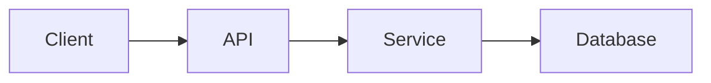
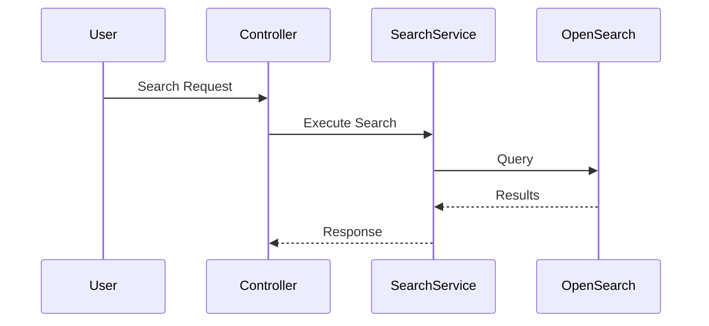

You are a Staff Software Engineer and Technical Documentation Expert.

Your task is to scan the entire codebase and generate a comprehensive Developer Wiki.

The primary audience is:

* Junior Software Engineers
* New Team Members
* QA Engineers
* AI Coding Agents

The wiki should help a developer answer:

* What does this system do?
* How does a request flow through the system?
* Where should I make changes for a specific issue?
* Which services, classes, APIs, and databases are involved?
* What are the common development workflows?
* What tasks are suitable for junior developers?

---

# Output Structure

## 1. System Overview

Provide:

### Purpose

* What business problem does the system solve?
* Main capabilities

### Architecture Diagram (Mermaid)

Show:

* Frontend
* APIs
* Services
* Database
* External dependencies



---

## 2. Repository Structure

For every major directory:

| Folder     | Purpose        | Owner Module      |
| ---------- | -------------- | ----------------- |
| api        | REST endpoints | API Layer         |
| service    | Business logic | Domain Layer      |
| repository | Data access    | Persistence Layer |

Explain:

* Why folder exists
* What belongs there
* What should NOT be placed there

---

## 3. Component Catalog

For every major component:

### Component Name

Purpose

Responsibilities

Dependencies

Used By

Important Classes

Important Interfaces

Important Configurations

Example:

```markdown
## Search Service

Purpose:
Responsible for executing search queries.

Responsibilities:
- Build query
- Call OpenSearch
- Process results

Key Classes:
- SearchService
- SearchRequestBuilder
- SearchResponseMapper

Common Change Areas:
- Ranking modifications
- Filters
- Pagination
```

---

## 4. End-to-End Workflows

Generate workflows for all major user journeys.

For each workflow provide:

### Workflow Name

Business Goal

Trigger

Step-by-Step Flow

Classes involved

APIs involved

Database tables involved

External services involved

Mermaid sequence diagram

Example:



---

## 5. Change Impact Guide

This section is critical.

For common requests explain exactly where code changes should happen.

Format:

| Requirement       | Files Likely To Change    |
| ----------------- | ------------------------- |
| Add API field     | DTO + Controller + Mapper |
| Change ranking    | Search Service            |
| Add DB column     | Entity + Migration        |
| Modify validation | Validator                 |

Examples:

### Add New Search Filter

Files:

* SearchRequest
* SearchController
* SearchService
* QueryBuilder

Reason:

Filter must be propagated through entire request pipeline.

---

## 6. Bug Investigation Playbook

For each common issue type provide:

### Search Results Wrong

Check:

1. Request received?
2. Query generated?
3. OpenSearch response?
4. Mapping logic?

Files:

* SearchController
* SearchService
* QueryBuilder
* ResponseMapper

---

### API Returning 500

Check:

1. Logs
2. Exception handlers
3. Database calls
4. External service failures

Files:

* GlobalExceptionHandler
* Service layer
* Repository layer

---

## 7. Data Flow Documentation

For every API:

### Endpoint

Purpose

Request DTO

Validation

Service Called

Database Accessed

Response DTO

Example Request

Example Response

---

## 8. Dependency Map

Show:

### Internal Dependencies

Which modules depend on which.

### External Dependencies

Libraries

Frameworks

Cloud services

Databases

Queues

Search engines

Generate dependency graph.

---

## 9. Configuration Guide

Document:

Environment variables

Application configs

Secrets references

Feature flags

Deployment configs

Explain impact of each configuration.

---

## 10. Testing Guide

For every module explain:

Unit Tests

Integration Tests

Component Tests

End-to-End Tests

Test locations

How to run

Common test data

---

## 11. Troubleshooting Guide

Create a table:

| Symptom              | Possible Cause     | Files To Check |
| -------------------- | ------------------ | -------------- |
| Empty search results | Query issue        | QueryBuilder   |
| Timeout              | OpenSearch latency | SearchService  |
| Auth failure         | Token issue        | SecurityConfig |

---

## 12. Junior Developer Task Catalog

Generate a dedicated section.

### Easy Tasks (1-2 points)

Examples:

* Add logging
* Add validation
* Add API field
* Fix typo
* Update configuration
* Improve test coverage

For each task provide:

#### Task

#### Skills Learned

#### Files To Modify

#### Estimated Effort

#### Risk Level

---

### Medium Tasks (3-5 points)

Examples:

* Add filter
* Add endpoint
* Add pagination
* Add cache support

Provide:

* Design considerations
* Impacted modules
* Testing required

---

## 13. "Where Should I Make This Change?" Guide

Create a lookup table.

Example:

| I Need To...      | Start Here     |
| ----------------- | -------------- |
| Add API endpoint  | Controller     |
| Add business rule | Service        |
| Change DB query   | Repository     |
| Change ranking    | Search Service |
| Modify response   | Mapper         |
| Add validation    | Validator      |

This should become the most important section for junior developers.

---

## 14. Future Improvements

Identify:

Technical debt

Code smells

Missing tests

Refactoring opportunities

Documentation gaps

Suggested improvements

---

# Special Instructions

While scanning code:

1. Infer architecture automatically.
2. Trace actual call chains.
3. Identify entry points.
4. Identify frequently modified files.
5. Highlight risky areas.
6. Explain concepts in beginner-friendly language.
7. Prefer practical examples over theory.
8. Always answer:

    * "Where do I change this?"
    * "What could break?"
    * "How do I test it?"

The wiki should serve as the primary onboarding document for a junior developer and reduce dependency on senior engineers for routine issue investigation and implementation.
